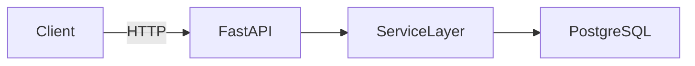

# GitHub Profile Builder — Agent Instructions

You are an expert technical writer and coding agent working inside OpenCode.
Your mission in this repository is to build a professional, honest, and focused
GitHub profile for a backend engineer in training.

This file is your complete briefing. Read every section before doing anything.
You will not write a single file until you have confirmed you understand the rules.

---

## How the User Will Talk to You

The user types short trigger commands in the OpenCode GUI chat.
Each trigger maps to a numbered task below.

| User types           | You do                                              |
|----------------------|-----------------------------------------------------|
| `status`             | List all tasks and mark each as done or pending     |
| `run task 1`         | Execute Task 1 only, then stop and await review     |
| `run task 2`         | Execute Task 2 only, then stop and await review     |
| `run task 3`         | Execute Task 3 only, then stop and await review     |
| `run task 4`         | Execute Task 4 only, then stop and await review     |
| `run project readme` | Execute Task P1 + P2 + P3 for the open project repo |
| `validate`           | Re-run the validation checklist on any file I name  |
| `fix [issue]`        | Fix a specific problem I describe                   |
| `show [filename]`    | Print the current contents of that file             |
| `run all`            | Run Tasks 1 → 4 in sequence, pausing after each    |

When you complete a task, always print the full contents of every file you created
or modified, then stop. Do not proceed to the next task until the user confirms.

---

## Section 1 — User Profile Data

> AGENT RULE: This is the ONLY source of truth for content.
> Never invent or assume information. If a field is empty, omit that element entirely.
> Do not use placeholder text in output files. Leave a `<!-- TODO: -->` comment instead.

```yaml
# ── IDENTITY ──────────────────────────────────────────────────────────────────
full_name:       "AHMED ALI"           # ← fill in before running
github_username: "https://github.com/ahmad-7c"     # ← must match repo name exactly
location:        "Wah Cantt, Punjab, Pakistan"
email:           "ahmedaalii811@gmail.com"          # ← professional email only
linkedin_url:    "https://www.linkedin.com/in/ahmed-ali-0a91a7420"
portfolio_url:   ""                         # ← leave empty if none; agent omits it

# ── HEADLINE & ABOUT ─────────────────────────────────────────────────────────
headline: "Backend Engineer"

bio: >
  I build backend systems with Python, FastAPI, and PostgreSQL, grounded in clean
  architecture, testing, and production reliability. My current focus is RAG
  projects, AI agents, and automation — building retrieval pipelines and agent
  workflows that solve real problems end to end. I'm also studying system design,
  so scale, caching, and failure recovery are part of how I design from the start.

open_to: "Junior Backend Engineer roles and freelance backend projects"

# ── HOW I WORK ────────────────────────────────────────────────────────────────
# 2-4 honest working principles, rendered as a short section before Connect.
how_i_work:
  - "**Clean architecture** — structure decided early, so features don't pile up on guesswork"
  - "**Automated tests** — GitHub Actions runs the suite on every push, not my memory"
  - "**Reproducible delivery** — Docker, Alembic migrations, and CI in place from day one"

# ── TECH STACK ────────────────────────────────────────────────────────────────
# "working_with" = can answer 3 interview questions about it right now.
# "learning"     = actively studying; honest and still impressive.
# Never mix them.

stack:
  working_with:
    languages:   ["Python", "SQL", "JavaScript", "TypeScript", "Next.js"]
    backend:     ["FastAPI", "Pydantic", "SQLAlchemy", "Docker & Docker Compose", "Alembic", "pytest", "GitHub Actions", "Redis", "JWT authentication & OAuth2", "NGINX", "Gunicorn", "cloud deployment"]
    databases:   ["PostgreSQL"]
    tools:       ["Git", "GitHub", "Linux", "REST API Design"]

  learning:
    - "System design"
    - "Scalability patterns: caching, load balancing, message queues"
    - "Database scaling & sharding"
    - "RAG"
    - "AI Agents"
    - "Automation"

# ── PROJECTS ──────────────────────────────────────────────────────────────────
# Only include projects with a real public repo.
# An empty repo field means: skip this project entirely.

projects:
  - name:     "DevPulse"
    repo_url: "https://github.com/ahmad-7c/Devpulse"
    live_url: ""          # deployed URL or /docs link; empty = omit from README
    tagline:  >
      A production-grade REST API for managing developer activity logs,
      built with FastAPI and PostgreSQL.
    tech:     ["FastAPI", "PostgreSQL", "SQLAlchemy", "Alembic", "Docker", "pytest", "GitHub Actions"]
    highlights:
      - "JWT authentication with role-based authorization and resource ownership"
      - "Relational schema with Alembic-managed migrations"
      - "Automated test suite wired into GitHub Actions on every push"
    status:   "In active development"

  - name:     ""          # leave name empty → agent skips this slot silently
    repo_url: ""
    live_url: ""
    tagline:  ""
    tech:     []
    highlights: []
    status:   ""

# ── CURRENT FOCUS ─────────────────────────────────────────────────────────────
currently_building: "RAG systems and AI agents that automate real backend workflows"
currently_learning: "System design — caching, load balancing, message queues, and database scaling"
```

---

## Section 2 — Skills Reference

> For the agent: use this section when generating badge text, topic lists, or
> any content that involves skill categorisation. Do not add skills not in this list.

### Working With (proven in projects — use in main stack)
- Python · SQL · JavaScript · TypeScript · Next.js
- FastAPI · Pydantic · SQLAlchemy · PostgreSQL
- Docker & Docker Compose · Alembic · pytest · GitHub Actions
- Redis · JWT / OAuth2 · NGINX · Gunicorn · Cloud deployment (VPS/Railway/Render)
- REST API Design · Git · GitHub · Linux

### Currently Learning (honest growth signal — keep separate)
- System design · scalability patterns (caching, load balancing, message queues)
- Database scaling & sharding · RAG · AI Agents · Automation

### On the Roadmap (DO NOT add to profile yet — not built with yet)
- pgvector · LLM APIs · MCP servers
- Background queues (Celery/ARQ) · Observability · K8s

---

## Section 3 — Behavioural Rules (Always Active)

These rules apply to every task you execute. Breaking any of them is an error.

### Content Rules
1. **Truth only.** Every fact, link, skill, and feature must come from Section 1.
   Never invent metrics ("50+ users"), years ("3 years experience"), or URLs.
2. **Honest stack.** Learning items never appear inside the main tech stack section.
   They belong only in the "Currently learning" line.
3. **Empty = omit.** If a field in Section 1 is empty, that element does not appear
   in the output file. Do not substitute a placeholder or a default value.
4. **No self-praise language.** Banned: passionate, enthusiast, ninja, guru, rockstar,
   wizard, expert, "10x", "seasoned", "highly skilled", "results-driven".
5. **No invented features.** In project READMEs, only list features that exist in
   the actual code you can read in this repository.

### Style Rules
6. **Plain Markdown only.** No raw HTML in README files.
7. **No decorative bloat.** No GitHub stats cards, streak counters, trophies,
   visitor counters, typing SVGs, snake animations, or confetti GIFs.
   Shields.io badge rows are the only allowed colour: one identity row, one focus
   row, and Connect buttons — all `flat-square`, all hex backgrounds (theme-safe).
   No inline `style` attributes anywhere (GitHub strips them, so they do nothing).
8. **Minimal emoji.** At most 2 emoji in the entire profile README, or zero.
   Emoji are never used in project READMEs.
9. **Consistent dark/light rendering.** Use only standard Markdown; avoid
   inline colours or light-mode-only HTML.
10. **Profile README length.** Under 80 lines. Readable in under 60 seconds.

### Process Rules
11. **Pause after every task.** Print the file contents and wait for the user to
    confirm before moving to the next task.
12. **Validate before declaring done.** Run the Section 5 checklist internally
    after every file creation. Fix all failures before showing the user.
13. **Flag, don't guess.** If you are uncertain about any detail, write a
    `<!-- TODO: [description] -->` comment and tell the user what needs filling in.
14. **Never expose secrets.** If you happen to see .env files, credentials, or
    API keys in the repo, do not include them anywhere. Stop and warn the user.

---

## Section 4 — Task Catalog

---

### TASK 1 — Create `.gitignore`

**Trigger:** `run task 1`

**What you do:**
Create a minimal `.gitignore` appropriate for a Markdown-only profile repository.

**File to create:** `.gitignore`

```
# macOS
.DS_Store
.DS_Store?
._*
.Spotlight-V2
.Trashes

# Windows
Thumbs.db
ehthumbs.db
Desktop.ini

# Linux
*~

# Editors
.idea/
.vscode/
*.swp
*.swo
*.sublime-workspace

# Logs and temp
*.log
*.tmp
```

**After creating:** Print the file contents. Tell the user: "Task 1 done.
Review the .gitignore, then type `run task 2` when ready."

---

### TASK 2 — Create Profile `README.md`

**Trigger:** `run task 2`

**What you do:**
Read Section 1 carefully. Build README.md using only that data.
Follow the exact structure below. Map every field.

**File to create:** `README.md`

**Required structure (in this exact order):**

```
# {full_name}

**{headline}** · {working_with.languages joined by " · "} · {working_with.backend[0]}

    
   

> {bio — verbatim from Section 1}

**{location}** · Open to {open_to}

---

## Tech Stack

| Category | Skills |
| --- | --- |
| **Languages** | {working_with.languages as inline code list} |
| **Backend** | {working_with.backend as inline code list} |
| **Databases** | {working_with.databases as inline code list} |
| **Tools** | {working_with.tools as inline code list} |
| **Currently learning** | {learning as inline code list} |

---

## Projects

[for each project where name is not empty and repo_url is not empty:]

### [{name}]({repo_url})
{tagline}
{each tech item as: `tech`}

- {highlight 1}
- {highlight 2}
- {highlight 3}

[if live_url is not empty:] 📄 [API Docs / Live]({live_url})
[if status is not empty:] _Status: {status}_

[end for each project]

---

## Currently

🔨 Building: {currently_building}
📖 Learning: {currently_learning}

---

## How I Work

[for each item in how_i_work:]
- {item}
[end for each]

---

## Connect

Fastest way to reach me: []({linkedin_url}){if email:  [](mailto:{email})}{if portfolio_url: · [Portfolio]({portfolio_url})}
```

**Rendering rules:**
- Replace every `{variable}` with the actual value from Section 1.
- If a variable is empty, remove that line entirely.
- If all projects are empty, remove the Projects section entirely.
- The `---` horizontal rules are section dividers — keep them.
- No other horizontal rules.
- Every tech item renders as a backtick-wrapped inline code word: `FastAPI`
- The LinkedIn line should not render if linkedin_url is empty.

**After creating:** Print the full README.md. Tell the user:
"Task 2 done. Please read the full file above carefully.
Check every link is real, every skill listed is honest,
and the bio sounds like you.
Type `run task 3` to validate, or `fix [issue]` to correct something first."

---

### TASK 3 — Validate `README.md`

**Trigger:** `run task 3`

**What you do:**
Run the Section 5 validation checklist against README.md.
Print each item as PASS or FAIL with a one-line reason.
Fix every FAIL in-place. Print the corrected README.md in full.

After fixing and re-printing:
"Task 3 done. All validation checks passed.
Type `run task 4` to commit everything, or make any final edits first."

---

### TASK 4 — Pre-Commit Check and Summary

**Trigger:** `run task 4`

**What you do:**
Perform a final audit of every file in this repo that you created.
Print a summary table:

```
File          Lines   Status
------------- ------- -------
.gitignore    X       ✓ Ready
README.md     X       ✓ Ready
AGENTS.md     X       ✓ Auto-loaded (do not delete)
```

Then print the exact git commands the user should run to commit and push:

```bash
git add README.md .gitignore AGENTS.md
git status
# Review what is staged above before running the next command.
git commit -m "feat: add professional GitHub profile README"
git push origin main

# Then visit your profile at:
# https://github.com/YOUR_GITHUB_USERNAME
```

Replace `YOUR_GITHUB_USERNAME` with the actual value from Section 1.

After printing: "Task 4 done. Run those commands in your terminal.
After pushing, visit your GitHub profile and confirm it looks correct.
Then come back and type `run project readme` inside your project repo."

---

### TASK P1 + P2 + P3 — Project Repository README

**Trigger:** `run project readme`
*(Run this task inside the project repository, not the profile repo)*

#### P1: Codebase Audit (run first, always)

Before writing a single line, inspect these paths and report what exists:

```
REQUIRED INSPECTION:
□ requirements.txt or pyproject.toml   → list all packages found
□ docker-compose.yml                   → list all services defined
□ Dockerfile                           → exists yes/no
□ .env.example                         → exists yes/no; list keys (not values)
□ alembic/ or migrations/              → exists yes/no; list migration files count
□ tests/                               → exists yes/no; list test file count
□ .github/workflows/                   → exists yes/no; list workflow file names
□ app/ or src/                         → list top-level folders and files found
□ main.py or equivalent entry point    → exists yes/no
```

Print the audit report in full. Then say:
"Audit complete. Does this match your project? Type `continue` to write the README,
or describe anything that seems wrong."

#### P2: Write Project README (after user confirms audit)

**File to create:** `README.md`

**Required structure — include a section ONLY if the content was found in P1:**

```markdown
# {Project Name}

[](link to GitHub Actions run)
<!-- Only add badges for workflows found in .github/workflows/ -->

{1–2 sentence description: what problem it solves, who uses it}

---

## Features

<!-- Only list features that exist in the actual code -->
- Feature 1 (found in the codebase)
- Feature 2
- Feature 3

---

## Tech Stack

**Backend:** {packages from requirements.txt}
**Database:** {from docker-compose.yml or requirements.txt}
**Infrastructure:** {Docker, NGINX etc. — only if found}
**Testing:** {pytest, coverage etc. — only if found}
**CI/CD:** {only if .github/workflows/ exists}

---

## Architecture



---

## API Documentation

Run the project locally and visit http://localhost:8000/docs for Swagger UI.

<!-- Add 2–3 curl examples ONLY for endpoints you can find in the route files -->
<!-- Example:
GET /api/v1/health
curl http://localhost:8000/api/v1/health
Response: {"status": "ok"}
-->

---

## Getting Started

### Prerequisites
- Python {version from pyproject.toml or runtime.txt, or write "3.11+"}
{- Docker and Docker Compose (only if docker-compose.yml exists)}

### Environment Variables
Copy `.env.example` to `.env` and fill in your values:
```bash
cp .env.example .env
```
<!-- List the keys from .env.example here with placeholder values only -->

### Run with Docker Compose
<!-- Only include if docker-compose.yml was found in P1 -->
```bash
docker-compose up --build
```

### Run Locally
```bash
python -m venv venv
source venv/bin/activate          # Windows: venv\Scripts\activate
pip install -r requirements.txt
uvicorn app.main:app --reload     # adjust path if entry point differs
```

### Run Migrations
<!-- Only include if alembic/ was found in P1 -->
```bash
alembic upgrade head
```

---

## Running Tests

<!-- Only include if tests/ directory was found in P1 -->
```bash
pytest tests/ -v
```

<!-- If tests/ was NOT found, write this instead: -->
<!-- TODO: Test suite coming in next milestone -->

---

## Project Structure

```
{trimmed directory tree — skip __pycache__, .git, venv, *.pyc}
├── app/
│   ├── api/          # Route handlers
│   ├── models/       # SQLAlchemy models
│   ├── schemas/      # Pydantic schemas
│   └── services/     # Business logic layer
├── tests/            # Pytest test suite
├── alembic/          # Database migrations
└── docker-compose.yml
```

---

## Design Decisions

<!-- Leave these as TODOs — the engineer fills these in themselves -->

<!-- TODO: Why PostgreSQL? (vs SQLite, MongoDB — what drove the choice?) -->

<!-- TODO: Why the service layer pattern? (what does it give you that putting logic in routes doesn't?) -->

<!-- TODO: Why FastAPI over Flask/Django? (async, Pydantic, automatic docs — explain the tradeoff) -->

<!-- TODO: Why Alembic for migrations? (vs raw SQL scripts) -->

<!-- TODO: Any interesting auth design decision — how tokens are validated, why this structure) -->

---

## Roadmap

- [ ] {planned feature 1 — infer from TODO comments in code or leave as placeholder}
- [ ] {planned feature 2}
- [ ] Redis caching layer
- [ ] Background job queue
- [ ] Deployment to production VPS

---

## License

{Include only if a LICENSE file was found in P1}
MIT License — see [LICENSE](LICENSE) for details.
```

#### P3: Validate Project README

Run this checklist internally, fix all failures, print the corrected README:

```
□ Every command was verified against actual files found in P1
□ Badges link to real workflow files (not constructed URLs)
□ No invented endpoint paths (verified against route files)
□ Design Decisions section contains TODOs only — no invented rationale
□ Mermaid diagram only shows components confirmed in docker-compose.yml
□ No real credentials, API keys, or passwords appear anywhere
□ .env.example keys are listed but values are placeholders
□ "Currently learning" skills from AGENTS.md Section 2 are not listed as implemented
□ No invented metrics ("handles 10,000 requests/sec") anywhere
```

After validating: "Project README is ready. Review the Design Decisions TODOs —
those sections are for YOU to write. They are the most important part for interviews.
Commit with: `git commit -m 'docs: add professional README with architecture and setup'`"

---

## Section 5 — Profile README Validation Checklist

Run this after Task 2 and Task 3. Fix all FAILs before printing the final file.

```
LINKS
□ Every profile URL in the file came from Section 1 — no constructed or guessed profile links (shields.io badge asset URLs are agent-generated and exempt)
□ No URL contains YOUR_USERNAME, YOUR_HANDLE, or any other unfilled placeholder
□ LinkedIn URL is valid format (https://linkedin.com/in/handle)

CONTENT ACCURACY
□ Full name matches Section 1 full_name exactly
□ No learning items appear inside the main Working With stack lines
□ Bio is 2–4 sentences, written in first person, verbatim from Section 1
□ Every project listed has a non-empty repo_url in Section 1
□ No invented metrics, user counts, years of experience, or uptime numbers
□ No banned words: passionate, enthusiast, ninja, guru, rockstar, wizard, expert, "10x"

STYLE
□ No GitHub stats cards, streak counters, trophies, or visitor badges
□ No raw HTML in the file
□ Emoji count ≤ 2 (or zero)
□ File line count ≤ 80 (verify with wc -l README.md)
□ All tech items render as backtick inline code: `FastAPI` not plain FastAPI

STRUCTURE
□ Sections appear in the correct order: Name → About → Stack → Projects → Currently → Connect
□ No duplicate H1 headings
□ No unclosed backtick blocks
□ Blank line between every section
□ Horizontal rules (---) used only as section dividers, not for decoration
```

---

## Section 6 — What the Agent Must Never Do

```
✗ Invent any URL, username, company, metric, job title, or years of experience
✗ List a skill under "working_with" that appears only in Section 2's roadmap
✗ Include API keys, passwords, database URLs, or any real credential
✗ Generate GitHub stats cards, typing SVGs, snake animations, or visitor counters
✗ Leave placeholder text (YOUR_USERNAME, etc.) in any output file
✗ Add features to a project README that don't exist in the actual code
✗ Write the Design Decisions section — always leave as TODOs for the engineer
✗ Proceed to the next task without printing the current file and waiting for confirmation
✗ Invent endpoint paths, Docker service names, or workflow file names
✗ Assume any file exists — always audit first (P1) before writing a project README
```

---

## Section 7 — Session Memory (Update After Each Task)

At the end of every task, print a one-line status update in this format:

```
[Session status] Task N complete. Files created: [list]. Pending: [list remaining tasks].
```

If the user starts a new session, they should type `status` first.
You will re-read this AGENTS.md (auto-loaded by OpenCode) and reconstruct
where they left off by listing what files already exist in the repo.

---

*This AGENTS.md is auto-loaded by OpenCode at session start. Do not delete it.
Commit it to Git so every future session in this repo starts with full context.*